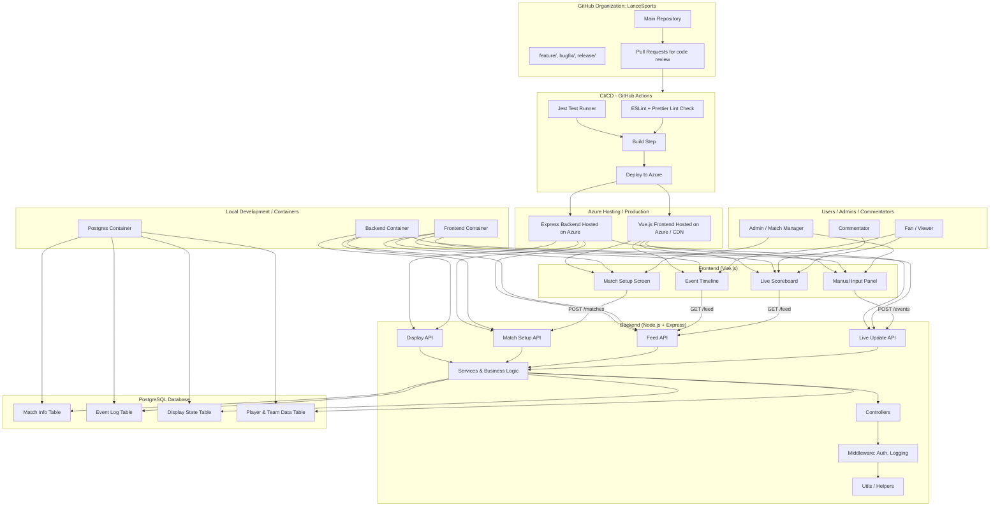

```mermaid
flowchart TD
    %% USERS
    subgraph USERS["Users / Admins / Commentators"]
        Fan[Fan / Viewer]
        Commentator[Commentator]
        Admin[Admin / Match Manager]
    end

    %% FRONTEND
    subgraph FRONTEND["Frontend (Vue.js)"]
        FE_Scoreboard[Live Scoreboard]
        FE_Timeline[Event Timeline]
        FE_MatchSetup[Match Setup Screen]
        FE_ManualInput[Manual Input Panel]
    end

    %% BACKEND
    subgraph BACKEND["Backend (Node.js + Express)"]
        API_Live[Live Update API]
        API_Feed[Feed API]
        API_Match[Match Setup API]
        API_Display[Display API]
        Services[Services & Business Logic]
        Controllers[Controllers]
        Middleware[Middleware: Auth, Logging]
        Utils[Utils / Helpers]
    end

    %% DATABASE
    subgraph DB["PostgreSQL Database"]
        MatchInfo[Match Info Table]
        EventLog[Event Log Table]
        DisplayState[Display State Table]
        PlayerTeam[Player & Team Data Table]
    end

    %% CI/CD
    subgraph CICD["CI/CD - GitHub Actions"]
        Lint[ESLint + Prettier Lint Check]
        Tests[Jest Test Runner]
        Build[Build Step]
        Deploy[Deploy to Azure]
    end

    %% DOCKER
    subgraph DOCKER["Local Development / Containers"]
        Docker_BE[Backend Container]
        Docker_FE[Frontend Container]
        Docker_DB[Postgres Container]
    end

    %% GITHUB ORG
    subgraph GITHUB["GitHub Organization: LanceSports"]
        Repo[Main Repository]
        Branches[feature/<name>, bugfix/<name>, release/<version>]
        PR[Pull Requests for code review]
    end

    %% HOSTING
    subgraph HOSTING["Azure Hosting / Production"]
        Azure_Backend[Express Backend Hosted on Azure]
        Azure_Frontend[Vue.js Frontend Hosted on Azure / CDN]
    end

    %% LINKS - USER INTERACTIONS
    Fan --> FE_Scoreboard
    Fan --> FE_Timeline
    Commentator --> FE_Scoreboard
    Admin --> FE_MatchSetup
    Admin --> FE_ManualInput

    %% FRONTEND <-> BACKEND
    FE_Scoreboard -->|GET /feed| API_Feed
    FE_Timeline -->|GET /feed| API_Feed
    FE_MatchSetup -->|POST /matches| API_Match
    FE_ManualInput -->|POST /events| API_Live

    %% BACKEND LOGIC
    API_Live --> Services
    API_Feed --> Services
    API_Match --> Services
    API_Display --> Services
    Services --> Controllers
    Controllers --> Middleware
    Middleware --> Utils

    %% BACKEND <-> DB
    Services --> MatchInfo
    Services --> EventLog
    Services --> DisplayState
    Services --> PlayerTeam

    %% LOCAL DEV WITH DOCKER
    Docker_FE --> FE_Scoreboard
    Docker_FE --> FE_Timeline
    Docker_FE --> FE_MatchSetup
    Docker_FE --> FE_ManualInput
    Docker_BE --> API_Live
    Docker_BE --> API_Feed
    Docker_BE --> API_Match
    Docker_BE --> API_Display
    Docker_DB --> MatchInfo
    Docker_DB --> EventLog
    Docker_DB --> DisplayState
    Docker_DB --> PlayerTeam

    %% CI/CD PIPELINE
    Repo --> PR
    PR --> CICD
    Lint --> Build
    Tests --> Build
    Build --> Deploy
    Deploy --> Azure_Backend
    Deploy --> Azure_Frontend

    %% AZURE HOSTING LINKS
    Azure_Backend --> API_Live
    Azure_Backend --> API_Feed
    Azure_Backend --> API_Match
    Azure_Backend --> API_Display
    Azure_Frontend --> FE_Scoreboard
    Azure_Frontend --> FE_Timeline
    Azure_Frontend --> FE_MatchSetup
    Azure_Frontend --> FE_ManualInput

```
